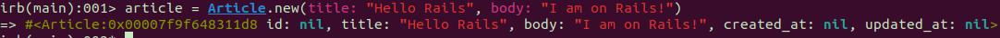

# Studying Ruby on Rails

Tutorial to learn and master Ruby on Rails.

https://guides.rubyonrails.org/

Ruby 3.2.1
Ruby on Rails 7.2.1

## Notes

https://guides.rubyonrails.org/getting_started.html

In this tutorial we'll gonna create a weblog.

## Generator

The generator application create a new Rails application and install the gem dependencies

```
$ rails new blog
```

You can see all of the command line options that the Rails application generator accepts by running `rails new --help`.

---

Me acaba de crear una aplicación rails con su propio git y una versión de rails que no quiero... Investigar...

**Respuesta:** resulta que cuando lancé el comando `rails new blog` estaba usando una version de rails 7.0.8. Para poder usar la versión que a mí me interesa, he tenido que crear un `Gemfile` con la gema Rails y lanzar un `bundle install`.

Al hacer una aplicación con este comando, te crea un git con la rama 'main' como principal (en vez de 'master')

Al haber doble git (el de esta carpeta y el de la carpeta `blog`) no puedo guardar todos los cambios a la vez en este mismo, así que he borrado la carpeta `.git` de la aplicación rails.

---

## Open/Run rails

When de new Rails application is created, you can run de Rails Server (running on Puma https://github.com/puma/puma).

```
$ bin/rails server
```

## Basic concepts

Rails is an MVC framework. It uses models, views and controllers, and also routes. https://en.wikipedia.org/wiki/Model%E2%80%93view%E2%80%93controller

In terms of implementation: Routes are rules written in a Ruby DSL (Domain-Specific Language). Controllers are Ruby classes, and their public methods are actions. And views are templates, usually written in a mixture of HTML and Ruby.

## Make Rails say "Hello"

https://guides.rubyonrails.org/getting_started.html#say-hello-rails

Añadir una ruta. Luego un controlador.

Para añadir un controlador, se puede usar el generador de Rails.

En este caso usamos `--skip-routes` porque ya la hemos creado.

```
$ bin/rails generate controller Articles index --skip-routes
```


Parece que también te crear los archivos para los tests.

Ahora ya podemos ir a `app/controllers/articles_controller.rb`.


Vemos que la acción `index` está vacía. Cuando no incluya una vista para renderizar específica, usará una vista que coincida el nombre con la acción. Convention Over Configuration!

Vista creada en `app/views/articles/index.html.erb`.


Substituimos contenido por `<h1>Hello, Rails!</h1>` y vamos a http://localhost:3000/articles


### Home Page

https://guides.rubyonrails.org/getting_started.html#setting-the-application-home-page

La ruta principal, por ahora, sigue siendo la página de prueba. Hay que definir una ruta a la página principal.


## Autoloading

https://guides.rubyonrails.org/getting_started.html#autoloading
more info: https://guides.rubyonrails.org/autoloading_and_reloading_constants.html

Rails tiene una "autocarga" de los objetos y librerías imprescindibles. Por lo tanto, no hay que usar `requiere "application_controller"` (por ejemplo), ya que con heredar es suficiente.

**You only need `require` calls for two use cases:**

- To load files under the `lib` directory.
- To load gem dependencies that have `require: false` in the `Gemfile`.

## Models

https://guides.rubyonrails.org/getting_started.html#mvc-and-you-generating-a-model

Para generar modelos con el generador:

```
$ bin/rails generate model Article title:string body:text
```


### Migraciones

Por defecto `create_table` añade una columna `id`

```
$ bin/rails db:migrate
```


Curiosament no demana fer un create.

### Modelo (clase)

Empezaremos trabajando por consola:

```
$ bin/rails console
```


```
irb> article = Article.new(title: "Hello Rails", body: "I am on Rails!")
```



```
irb> article.save
```


```
irb> Article.find(1)
irb> Article.all
```

Prueba tu

## Usando MVC para mostrar una lista de Articles

https://guides.rubyonrails.org/getting_started.html#showing-a-list-of-articles

Ahora que ya tenemos el modelo, solo falta poner al día el controlador y la vista:

**Controlador**

`app/controllers/articles_controller.rb`

```
class ArticlesController < ApplicationController
  def index
    @articles = Article.all
  end
end
```

**Vista**

`app/views/articles/index.html.erb`

```
<h1>Articles</h1>

<ul>
  <% @articles.each do |article| %>
    <li>
      <%= article.title %>
    </li>
  <% end %>
</ul>
```


Now: http://localhost:3000/

## CRUD

### Read

Ya hemos hecho el Read del índice, ahora el "single":

`config/routes.rb`

```
Rails.application.routes.draw do
  root "articles#index"

  get "/articles", to: "articles#index"
  get "/articles/:id", to: "articles#show"
end
```

`app/controllers/articles_controller.rb`

```
class ArticlesController < ApplicationController
  def index
    @articles = Article.all
  end

  def show
    @article = Article.find(params[:id])
  end
end
```

Y ahora falta la nueva vista: `app/views/articles/show.html.erb`

```
<h1><%= @article.title %></h1>

<p><%= @article.body %></p>
```

Por último, en la vista del `index` podemos añadir un enlace que lleve a la vista de detalles de cada Article.

```
<h1>Articles</h1>

<ul>
  <% @articles.each do |article| %>
    <li>
      <a href="/articles/<%= article.id %>">
        <%= article.title %>
      </a>
    </li>
  <% end %>
</ul>
```

### Resources

`resources` nos sirve para cubrir todo el CRUD en el `config/routes.rb`

```
Rails.application.routes.draw do
  root "articles#index"

  resources :articles
end
```


